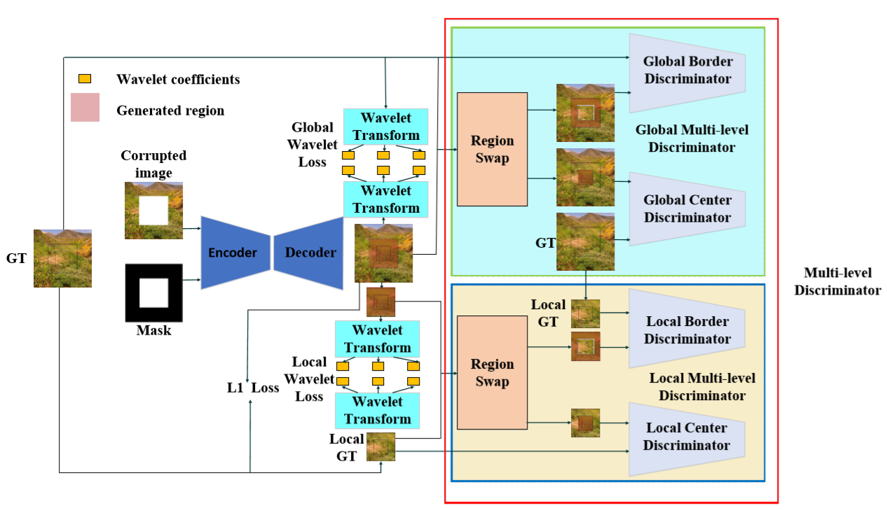
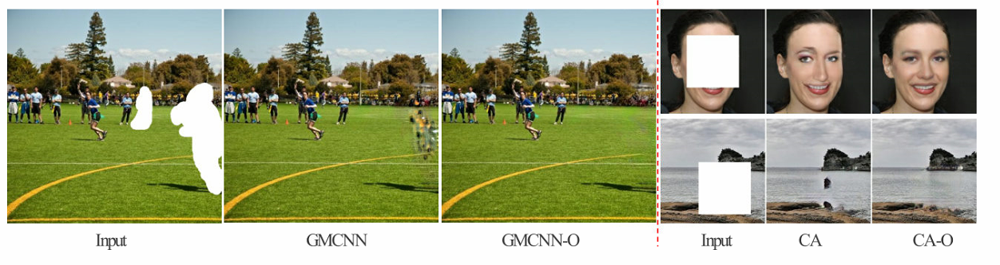
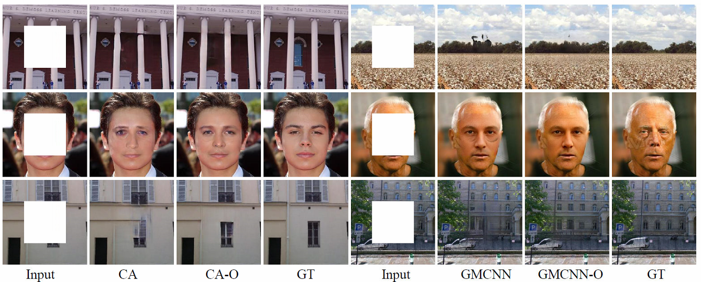
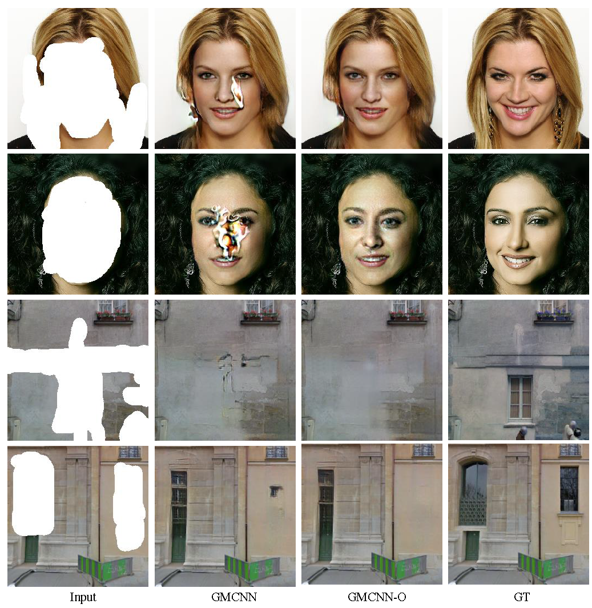
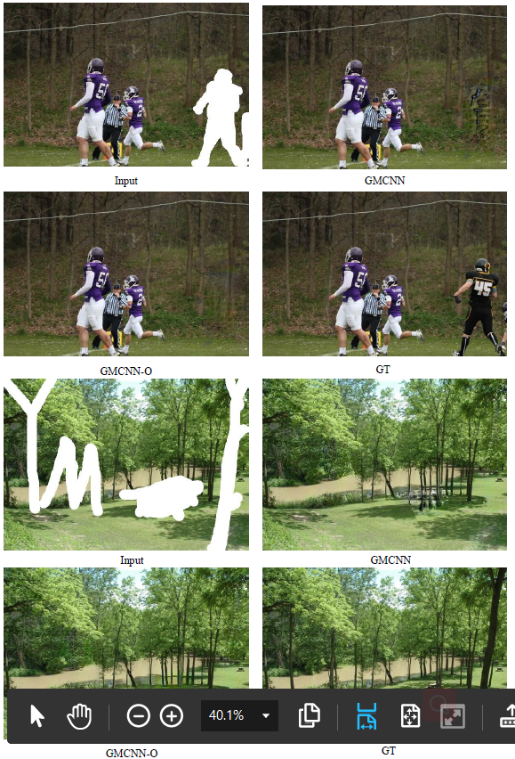

# Multi-Level Discriminator and Wavelet Loss for Image Inpainting with Large Missing Area
## Introduction

We propose a new discriminator architecture MLD and a new loss function WT loss to improve the current inpainting method in the case of large areas that are easy to cause artifacts. The method we proposed can be embedded in any GAN-based inpainting method, and will not bring any extra overhead of calculation in the inference stage.

## Our framework



## Results on CA(https://github.com/JiahuiYu/generative_inpainting/tree/v1.0.0) and GMCNN(https://github.com/shepnerd/inpainting_gmcnn).
.


## Results on Places2，Paris StreetView and CelebA-HQ with rectangular mask .

<p></p>

## Results on Paris StreetView and CelebA-HQ with irregular mask.




### [More results](https://drive.google.com/file/d/1uzYgpiCkENTqW-Yy-AriHXH0wUidi3KY/view?usp=sharing)

## Prerequisites
- Python3.5 (or higher)
- Tensorflow 1.4 (or later versions, excluding 2.x) with NVIDIA GPU or CPU
- OpenCV
- numpy
- scipy
- easydict

## Installation

```bash
git clone https://github.com/shepnerd/inpainting_gmcnn.git
cd inpainting_gmcnn/tensorflow

## For tensorflow implementations
### Testing

Download pretrained models through the following links ([paris_streetview](https://drive.google.com/file/d/1wgesxSUfKGyPwGQMw6IXZ9GLeZ7YNQxu/view?usp=sharing), [CelebA-HQ_256](https://drive.google.com/file/d/1cp5e8XyXmHNZWj_piHH4eg4HFi3ICl0l/view?usp=sharing), [Places2](https://drive.google.com/file/d/1aakVS0CPML_Qg-PuXGE1Xaql96hNEKOU/view?usp=sharing)), and unzip and put them into `checkpoints/`. To test images in a folder, you can specify the folder address by the opinion `--dataset_path`, and set the pretrained model path by `--load_model_dir` when calling `test.py`.

For example:

```bash
python test.py --dataset paris_streetview --data_file ./imgs/paris-streetview_256x256/ --load_model_dir ./checkpoints/paris-streetview_256x256_rect --random_mask 0
```
or
```bash
sh ./script/test.sh
```

### Training
For a given dataset, the training is formed of two stages. We pretrain the whole network with only confidence-driven reconstruction loss first, and finetune this network using adversarial and ID-MRF loss along with the reconstruction loss after the previous phase converges.

To pretrain the network,
```shell
python train.py --dataset [DATASET_NAME] --data_file [DATASET_TRAININGFILE] --gpu_ids [NUM] --pretrain_network 1 --batch_size 16
```
where `[DATASET_TRAININGFILE]` indicates a file storing the full paths of the training images.

Then finetune the network,
```shell
python train.py --dataset [DATASET_NAME] --data_file [DATASET_TRAININGFILE] --gpu_ids [NUM] --pretrain_network 0 --load_model_dir [PRETRAINED_MODEL_PATH] --batch_size 8
```
We provide both random <b>stroke</b> and <b>rectangle</b> masks in the training and testing phase. The used mask type is indicated by specifying `--mask_type [rect(default)|stroke]` option when calling `train.py` or `test.py`.

### A simple interactive inpainting GUI

A GUI written using tkinter is given in `painter_gmcnn.py`. Start it by calling
```shell
sh ./script/vis_tool.sh
```

### Other pretrained models
[CelebA-HQ_512](https://drive.google.com/open?id=14u58ZEUb6pg5mVwDlUIm6YDjiluqZoBU) trained with stroke masks.

## For pytorch implementations
The testing and training procedures are similar to these in the tensorflow version except some parameters are with different names.
### Testing
A pretrained model: [CelebA-HQ_256](https://drive.google.com/file/d/1lx0BHKQ-GsbFu60ocYm4wK1HVfv7uean/view?usp=sharing).

### Training
Compared with the tensorflow version, this pytorch version would expect a relatively smaller batch size for training.

## Disclaimer


## Acknowledgments
Our code is partially based on [CA](https://github.com/JiahuiYu/generative_inpainting/tree/v1.0.0) and [GMCNN](https://github.com/shepnerd/inpainting_gmcnn). 

### Contact

Please send email to hnljj@mail.ustc.edu.cn.

Here we supply the pretrained model of Places2 and CelebA-HQ.
Places2:

If our method is useful for your research, please consider citing:


