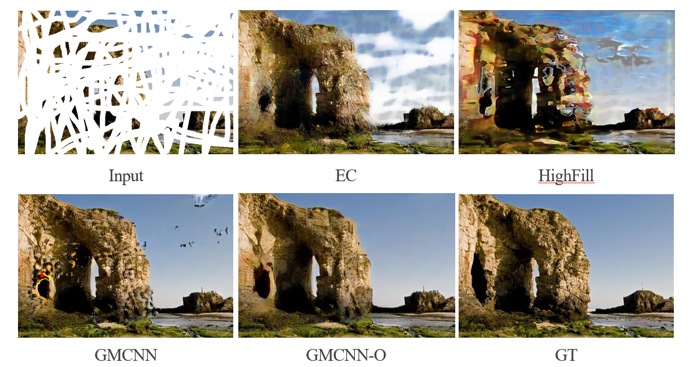
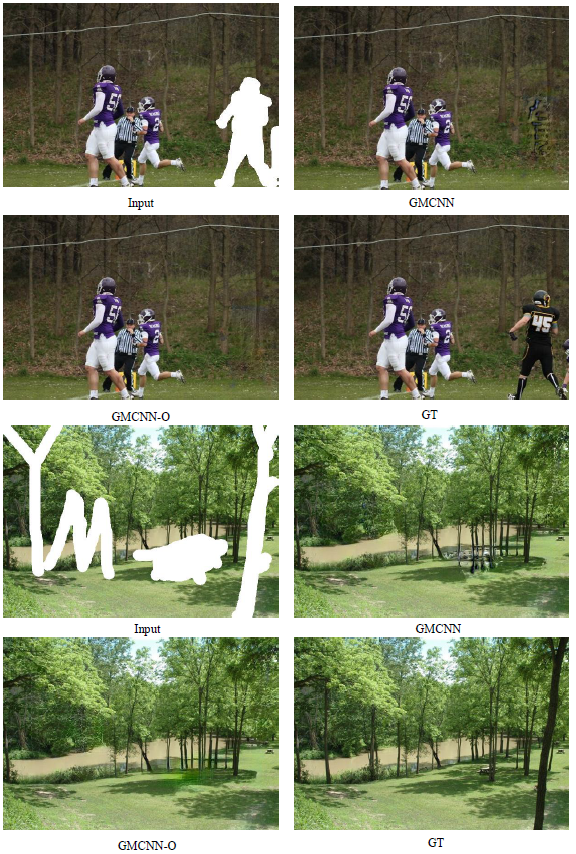

# Multi-Level Discriminator and Wavelet Loss for Image Inpainting with Large Missing Area
## Introduction

We propose a new discriminator architecture MLD and a new loss function WT loss to improve the current inpainting method in the case of large areas that are easy to cause artifacts. The method we proposed can be embedded in any GAN-based inpainting method, and will not bring any extra overhead of calculation in the inference stage. Particularly, we investigate the combinations with GMCNN and CA in this paper due to their good performance. In the experiment, we proved that embedding our method in GMCNN and CA can bring performance improvement.

## Our framework

## Comparing with different methods with large mask

## Vedio example

[video](https://www.youtube.com/watch?v=8Q9SuW-7rS0&feature=youtu.be)

## Results on CA and GMCNN.
.

## Results on Places2, CelebA-HQ and Paris StreetView with rectangular mask .

## Results on Paris StreetView and CelebA-HQ with irregular mask.

## More results

[vis_examples](https://github.com/ljjcoder/inpainting/tree/master/vis_examples)

## Code

Our code will be released soon.

## Acknowledgments
Our code is based on [CA](https://github.com/JiahuiYu/generative_inpainting/tree/v1.0.0) and [GMCNN](https://github.com/shepnerd/inpainting_gmcnn). 

### Contact

Please send email to hnljj@mail.ustc.edu.cn.

Here we supply the pretrained model of Places2 and CelebA-HQ.
Places2:

If our method is useful for your research, please consider citing:

